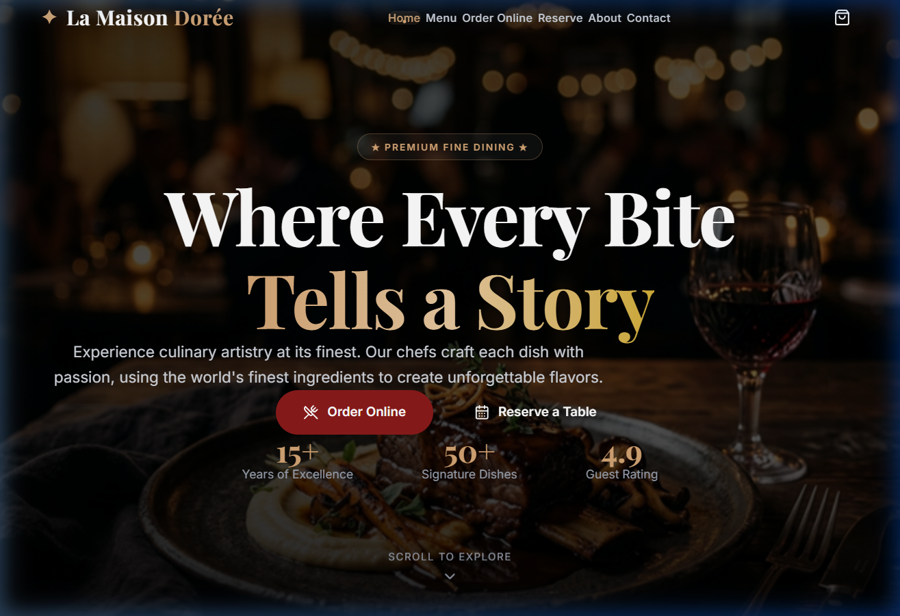

# 🍽️ La Maison Dorée — Premium Restaurant UI

A stunning, modern restaurant web application built with **React 19**, **Vite 7**, and **Tailwind CSS 4**. Designed to deliver a premium fine-dining digital experience with elegant animations, fully responsive layouts, and a cohesive warm color palette.



---

## ✨ Features

### 🏠 Homepage
- Full-screen cinematic hero section with background imagery
- Animated statistics counter (15+ Years, 50+ Dishes, 4.9 Rating)
- Featured dishes showcase with hover effects
- Customer testimonials carousel
- Call-to-action for reservations

### 📋 Menu Page
- Category-based filtering (Starters, Main Course, Desserts, Drinks)
- Elegant dish cards with badges (Popular, Chef's Pick, Must Try)
- Smooth scroll-reveal animations

### 🛒 Online Ordering
- Browse menu items with add-to-cart functionality
- Sticky cart sidebar with real-time updates
- Quantity controls and item removal
- Subtotal, delivery fee, and total calculation
- Checkout modal with delivery details and payment options
- Order confirmation animation

### 📅 Table Reservation
- Comprehensive booking form (Date, Time, Guests, Contact)
- Opening hours and special events information
- Animated confirmation feedback

### 📖 About Page
- Restaurant story and heritage section
- Core values and philosophy
- Interior imagery

### 📞 Contact Page
- Contact information (Address, Phone, Email)
- Message form for inquiries
- Clean two-column layout

### 🧩 Shared Components
- **Navbar** — Sticky navigation with mobile hamburger menu & cart badge
- **Footer** — 4-column layout (Brand, Quick Links, Hours, Contact)
- **Toast** — Notification system for cart actions

---

## 🛠️ Tech Stack

| Technology | Version | Purpose |
|---|---|---|
| [React](https://react.dev) | 19.2.0 | UI Framework |
| [Vite](https://vite.dev) | 7.3.1 | Build Tool & Dev Server |
| [Tailwind CSS](https://tailwindcss.com) | 4.2.1 | Utility-First Styling |
| [React Router DOM](https://reactrouter.com) | 7.13.1 | Client-Side Routing |
| [Lucide React](https://lucide.dev) | 0.576.0 | SVG Icon Library |

---

## 📁 Project Structure

```
Restaurant-UI/
├── public/
│   └── images/              # Food, chef, interior, and hero images
├── src/
│   ├── components/
│   │   ├── Navbar.jsx       # Sticky nav with mobile menu & cart
│   │   ├── Footer.jsx       # 4-column site footer
│   │   └── Toast.jsx        # Toast notification component
│   ├── context/
│   │   └── CartContext.jsx   # Shopping cart state management
│   ├── data/
│   │   └── menuData.js      # Menu items, categories & testimonials
│   ├── pages/
│   │   ├── Home.jsx          # Landing page with hero & features
│   │   ├── Menu.jsx          # Full menu with category filters
│   │   ├── Order.jsx         # Online ordering with cart
│   │   ├── Reservation.jsx   # Table booking form
│   │   ├── About.jsx         # Restaurant story
│   │   └── Contact.jsx       # Contact form & info
│   ├── App.jsx               # Root component with routing
│   ├── main.jsx              # React entry point
│   └── index.css             # Global styles & design system
├── index.html                # HTML entry with Google Fonts & SEO
├── vite.config.js            # Vite configuration
├── package.json              # Dependencies & scripts
└── README.md                 # You are here!
```

---

## 🚀 Getting Started

### Prerequisites

- **Node.js** ≥ 18.x
- **npm** ≥ 9.x

### Installation

1. **Clone the repository**
   ```bash
   git clone https://github.com/MALLIKARJUNAREDDYgali/Restaurant-UI.git
   cd Restaurant-UI
   ```

2. **Install dependencies**
   ```bash
   npm install
   ```

3. **Start the development server**
   ```bash
   npm run dev
   ```

4. **Open in browser**
   ```
   http://localhost:5173/
   ```

### Build for Production

```bash
npm run build
```

The production-ready files will be generated in the `dist/` directory.

### Preview Production Build

```bash
npm run preview
```

---

## 🎨 Design System

### Color Palette

| Color | Hex | Usage |
|---|---|---|
| Primary | `#8B1A1A` | Buttons, accents, prices |
| Primary Light | `#C41E3A` | Hover states |
| Accent Gold | `#D4A574` | Decorative elements, badges |
| Cream | `#FAF3E8` | Backgrounds |
| Dark | `#1A0A0A` | Text, dark sections |

### Typography

| Font | Family | Usage |
|---|---|---|
| **Playfair Display** | Serif | Headings, titles |
| **Inter** | Sans-serif | Body text, UI elements |
| **Cormorant Garamond** | Serif | Decorative accents |

---

## 📄 Available Scripts

| Command | Description |
|---|---|
| `npm run dev` | Start development server with HMR |
| `npm run build` | Build for production |
| `npm run preview` | Preview production build locally |
| `npm run lint` | Run ESLint checks |

---

## 🌐 Pages & Routes

| Route | Page | Description |
|---|---|---|
| `/` | Home | Landing page with hero, dishes, testimonials |
| `/menu` | Menu | Full menu with category filtering |
| `/order` | Order Online | Browse & add to cart with checkout |
| `/reservation` | Reserve | Table booking form |
| `/about` | About | Restaurant story & values |
| `/contact` | Contact | Contact form & information |

---

## 📱 Responsive Design

Fully responsive across all screen sizes:
- 📱 **Mobile** (< 640px) — Stacked layouts, hamburger menu
- 📱 **Tablet** (640px – 1024px) — 2-column grids
- 💻 **Desktop** (> 1024px) — Full multi-column layouts

---

## 🤝 Contributing

1. Fork the repository
2. Create your feature branch (`git checkout -b feature/amazing-feature`)
3. Commit your changes (`git commit -m 'Add amazing feature'`)
4. Push to the branch (`git push origin feature/amazing-feature`)
5. Open a Pull Request

---

## 📝 License

This project is open source and available under the [MIT License](LICENSE).

---

## 👤 Author

**Mallikarjuna Reddy Gali**

- GitHub: [@MALLIKARJUNAREDDYgali](https://github.com/MALLIKARJUNAREDDYgali)

---

<p align="center">
  Made with ❤️ and React
</p>
